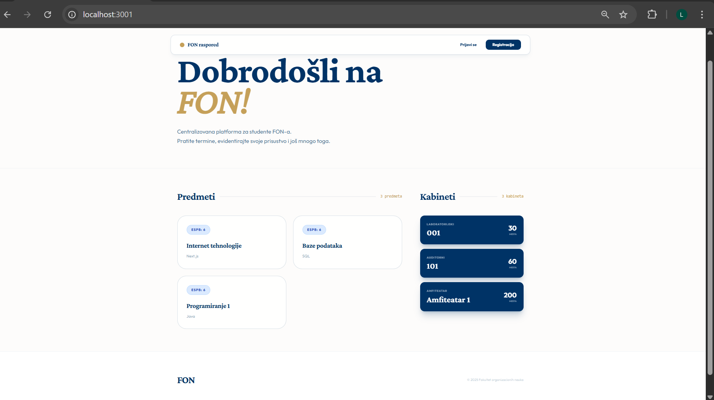
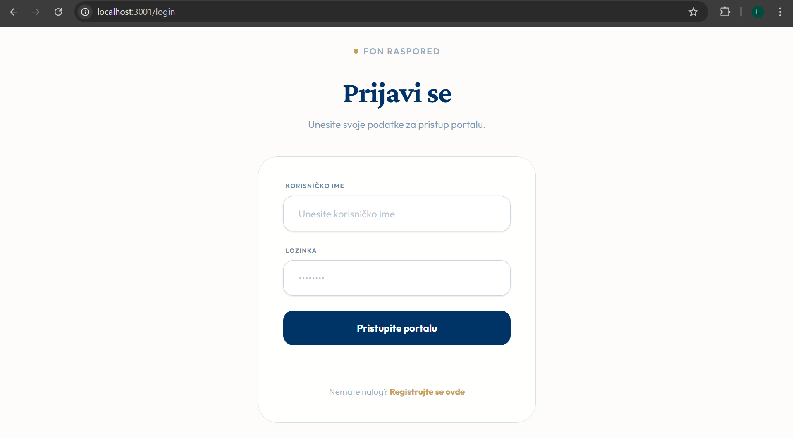
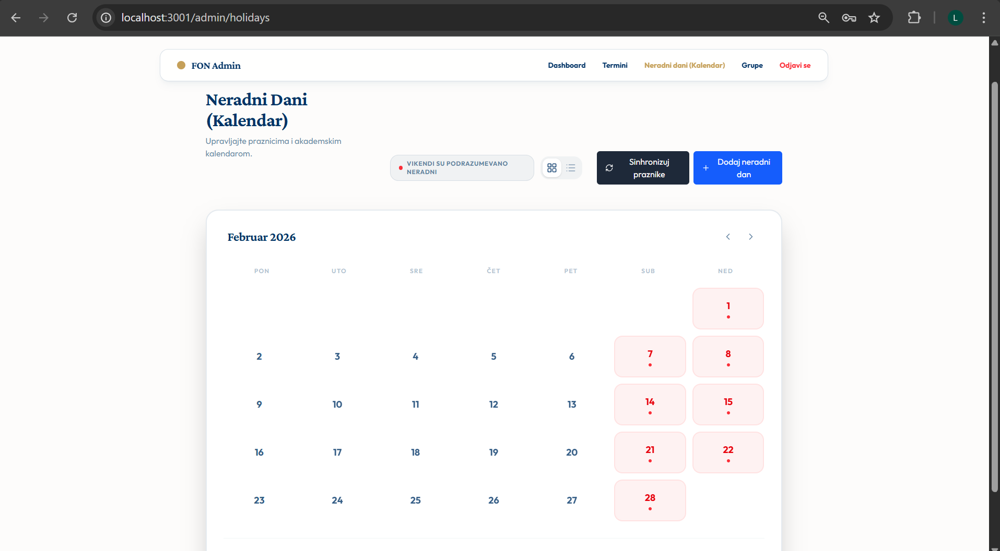
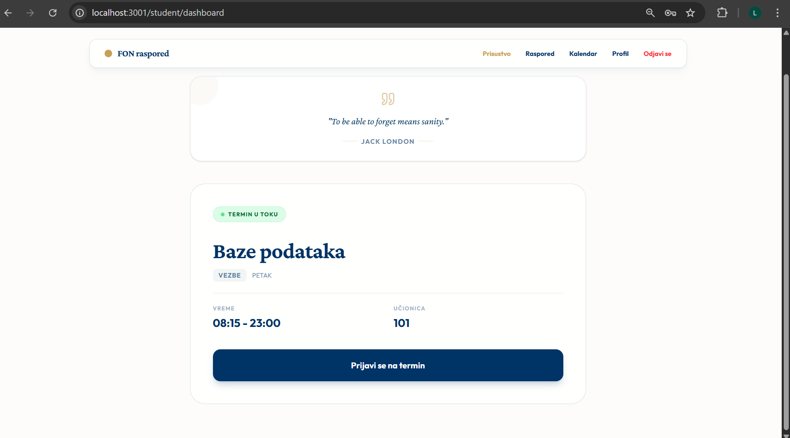
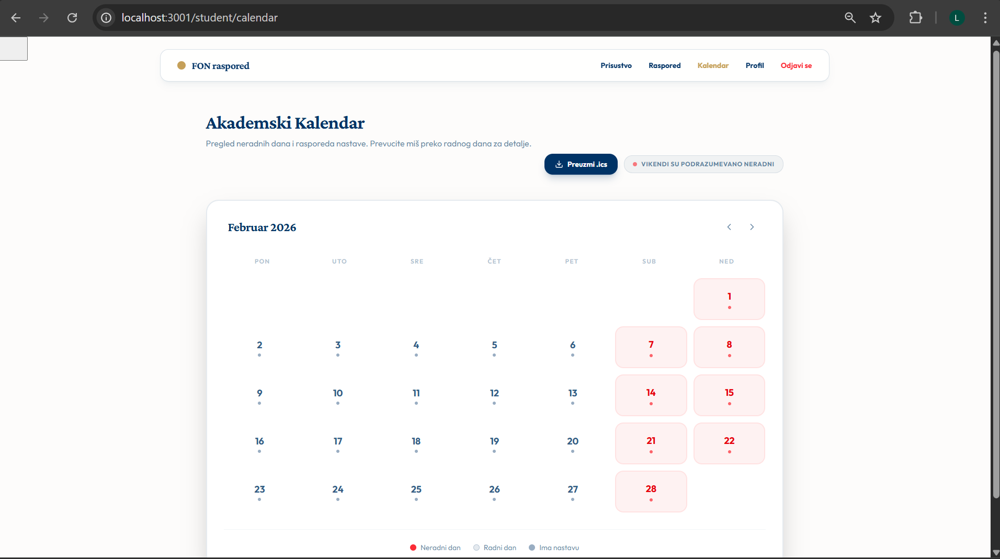
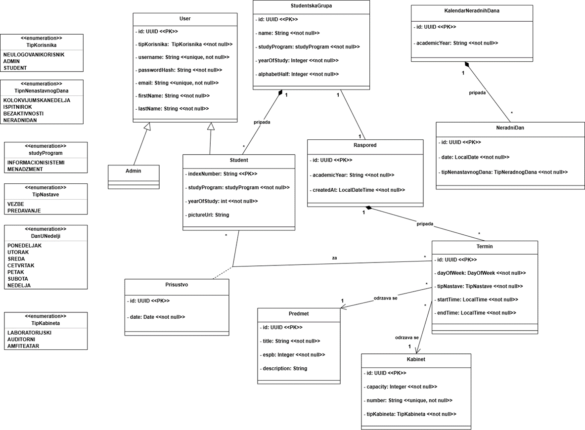

# Student Attendance, Calendar and Schedule Management System

A professional web application designed for tracking student attendance, managing academic schedules, and monitoring holiday calendars for higher education institutions.

## Overview

The Student Attendance and Schedule Management System provides a centralized platform for both students and administrators. It streamlines the process of attendance tracking and provides real-time visibility into academic schedules and important faculty events.

## Key Features

- **Dynamic Schedule Management**: Real-time view of weekly lectures, lab sessions, and academic terms.
- **Attendance Tracking**: Secure system for students to record their presence during active terms.
- **Administrative Dashboard**: Comprehensive controls for managing student groups, cabinets, subjects, and terms.
- **Holiday & Event Calendar**: Integrated management of academic calendar events, including exams, colloquium weeks, and holidays.
- **Performance Analytics**: Visual data representations of student attendance percentages and session statistics.
- **Secure Authentication**: Robust session management using JWT and HTTP-only cookies.

### Visual Overview


*Dashboard.*


*Login Page.*



*Admin Dashboard.*



*Student Dashboard.*


*Student Calendar, for their specific group.*

## Technical Architecture

The application is built with a focus on performance, type-safety, and modern web standards:

- **Framework**: Next.js 16 (App Router)
- **Database**: PostgreSQL
- **ORM**: Drizzle ORM
- **Styling**: Tailwind CSS and Vanilla CSS
- **Testing**: Vitest (Unit/Integration) and Playwright (End-to-End)
- **Environment**: Containerized using Docker and Docker Compose
- **CI/CD**: Fully automated pipeline via GitHub Actions and Vercel Deployment


### Database Schema



## Installation and Setup

### Prerequisites

- Node.js (Version 20 or higher)
- Docker and Docker Compose (recommended)

### Local Development

1. **Install dependencies**:
   ```bash
   npm install
   ```

2. **Environment Configuration**:
   Create a `.env` file based on `.env.template` and configure the required variables (DATABASE_URL, JWT_SECRET, etc.).

3. **Database Initialization**:
   ```bash
   npm run db:setup
   ```

4. **Start the development server**:
   ```bash
   npm run dev
   ```

### Docker Implementation

To deploy the full infrastructure stack (Database, pgAdmin, and Application):
```bash
docker-compose up -d --build
```
The application will be accessible at `http://localhost:3001` by default.

## API Documentation

The project includes an OpenAPI 3.0 specification (`openapi.yaml`) detailing all available endpoints for authentication, administration, and student services.


